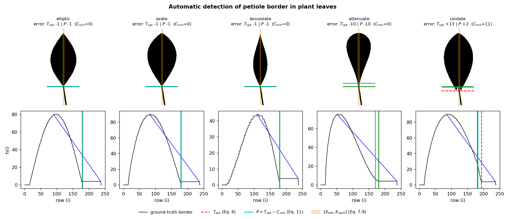

# Automatic Detection of Petiole Border in Plant Leaves

Python reference implementation of the method proposed in

> A. Elen and E. Avuçlu, "Automatic detection of petiole border in plant leaves," *Measurement and Control*, vol. 54, no. 3–4, 2021. [doi:10.1177/0020294020917701](https://doi.org/10.1177/0020294020917701)

The method automatically separates a leaf image into its **blade** (lamina) and **petiole** (leaf stalk). It is a purely geometric, training-free approach: the cumulative pixel distributions of a binary leaf image along the **Y-axis** and **X-axis** are analysed, an optimum threshold is found on the Y-axis profile with a triangle construction, the petiole width is located on the X-axis profile, and a final correction accounts for the basal sinus of heart-shaped leaves. The border is therefore determined directly from changes in pixel density across the image.



*Top row: synthetic binary leaves with a known petiole/blade junction (green), the triangle threshold $T_{opt}$ (red, dashed), the final border $P$ (cyan) and the petiole column range $[X_{left}, X_{right}]$ (orange). Bottom row: the Y-axis cumulative profile $h(i)$ with the triangle line from the maximum peak to the last non-zero row.*

## Method

The input is a binary leaf image oriented with the tip up and the petiole pointing down, scaled to width 100 (Eq. 12 of the paper). Equation numbers below refer to the paper.

**1. Optimum threshold, Eq. (1)–(6).** The Y-axis cumulative profile $h(i)$ counts the foreground pixels in each row $i$. Its end point $X_{min}$ is the first non-zero row scanning from the bottom (Eq. 1) and its maximum peak is at $X_{max}$ (Eq. 2), with heights $Y_{min} = h(X_{min})$ and $Y_{max} = h(X_{max})$ (Eq. 3–4). A line $d$ is drawn between these two points (Eq. 5) and the row of the profile with the largest perpendicular distance to $d$ is the optimum threshold (Eq. 6, triangle / Zack thresholding):

```math
T_{opt} = \arg\max_{i \in [X_{max},\, X_{min}]} \frac{|a\,i + b\,h(i) + c|}{\sqrt{a^2 + b^2}}
```

**2. Petiole width, Eq. (7)–(9).** On the X-axis cumulative profile of the region just below $T_{opt}$, the peak column $X_m$ (Eq. 7) is the centre of the petiole, and the nearest zero columns to its right and left give $X_{right}$ (Eq. 8) and $X_{left}$ (Eq. 9).

**3. Basal sinus correction, Eq. (10)–(11).** In cordate (heart-shaped) leaves the two basal lobes hang below the junction, so $T_{opt}$ falls too low. On the cropped blade image $I_c$ (rows $X_{max} \dots T_{opt}$), with rows numbered upward from its lower edge ($i = 1$ is the row just above $T_{opt}$):

```math
s(i) = \begin{cases} 1 & \text{if } R(i) \ge 2 \text{ and } \left[ I_c(i, X_{left}^{(i)} - 1) = 0 \ \text{or}\ I_c(i, X_{right}^{(i)} + 1) = 0 \right] \\ 0 & \text{otherwise} \end{cases}
```

```math
C_{min} = \min_i \left\{ i \mid i \in \{1, \dots, T_{opt} - X_{max}\} : s(i) = 0 \right\} - 1 \qquad (10)
```

```math
P = T_{opt} - C_{min} \qquad (11)
```

$R(i)$ is the number of separate foreground runs in row $i$, and $X_{left}^{(i)}, X_{right}^{(i)}$ are the petiole columns, starting from Eq. (7)–(9) and following a slanted petiole row by row. $C_{min}$ is the depth of the basal sinus; for a leaf without a sinus $C_{min} = 0$ and $P = T_{opt}$.

## Pseudocode

```text
Algorithm  PETIOLE-BORDER(I)
Input : binary leaf image I (H x W, tip up, petiole down, W = 100)
Output: petiole border row P

  // --- Step 1: optimum threshold on the Y-axis profile, Eq. (1)-(6) ---
  for each row i:  h(i) <- sum of I(i, :)
  X_min <- last row i with h(i) > 0                    // Eq. (1)
  X_max <- argmax_i h(i)                               // Eq. (2)
  Y_min <- h(X_min);  Y_max <- h(X_max)                // Eq. (3)-(4)
  line d through (X_max, Y_max) and (X_min, Y_min)     // Eq. (5)
  T_opt <- row i in [X_max, X_min] with the largest
           perpendicular distance from (i, h(i)) to d  // Eq. (6)

  // --- Step 2: petiole width on the X-axis profile, Eq. (7)-(9) ---
  for each column j:  g(j) <- sum of I(T_opt : T_opt + k, j)   // top of the petiole
  X_m     <- argmax_j g(j)                             // Eq. (7)
  X_right <- (first j > X_m with g(j) = 0) - 1         // Eq. (8)
  X_left  <- (last  j < X_m with g(j) = 0) + 1         // Eq. (9)

  // --- Step 3: basal sinus correction, Eq. (10)-(11) ---
  I_c <- rows X_max .. T_opt of I, flipped so that i = 1 is the row above T_opt
  w   <- X_right - X_left + 1
  i   <- 1
  while i <= T_opt - X_max:
      row <- I_c(i, :)
      if row has no foreground in [X_left - 1, X_right + 1]:  break     // s(i) = 0
      X_left  <- first foreground column in [X_left - 1, X_right + 1]   // track petiole
      X_right <- X_left + w - 1
      R <- number of separate foreground runs in row
      if R >= 2 and (row(X_left - 1) = 0 or row(X_right + 1) = 0):
          i <- i + 1                                                    // s(i) = 1
      else:
          break                                                         // s(i) = 0
  C_min <- i - 1                                       // Eq. (10)
  P     <- T_opt - C_min                               // Eq. (11)
  return P
```

## Results on synthetic leaves

The demo builds five synthetic leaf shapes with a slightly slanted petiole and a known junction row (180), so the error of each step can be measured exactly:

| Leaf shape | Ground truth | $T_{opt}$ (error) | $[X_{left}, X_{right}]$ | $C_{min}$ | $P$ (error) |
|---|---:|---:|:---:|---:|---:|
| elliptic   | 180 | 179 (−1)  | 49..53 | 0  | 179 (−1)  |
| ovate      | 180 | 179 (−1)  | 49..52 | 0  | 179 (−1)  |
| lanceolate | 180 | 179 (−1)  | 48..51 | 0  | 179 (−1)  |
| attenuate  | 180 | 170 (−10) | 46..51 | 0  | 170 (−10) |
| cordate    | 180 | 193 (+13) | 52..56 | 11 | 182 (+2)  |

For leaves whose base meets the petiole at a clear angle, $T_{opt}$ alone lands within one row of the true border. For the cordate leaf, the triangle threshold falls below the hanging lobes (+13 rows) and the sinus correction of Eq. (10)–(11) brings it back to +2. The attenuate (decurrent) leaf, whose blade narrows gradually into the petiole, is the hard case: there is no sharp knee in $h(i)$, so the border is placed about 10 rows early.

## Usage

```bash
pip install -r requirements.txt
python petiole_border.py            # prints the table above and saves figures/petiole_demo.png
python petiole_border.py --show     # also opens the figure window
```

To use the detector on your own image, binarise it (leaf = 1, background = 0), rotate it so that the petiole points down, scale it to width 100, and call:

```python
from petiole_border import detect_petiole_border

result = detect_petiole_border(binary_leaf)   # numpy array, values 0/1
P = result["P"]                               # border row: blade = rows < P, petiole = rows >= P
```

The returned dictionary also contains `T_opt`, `C_min`, `X_left`, `X_right`, the profile `h` and the triangle end points (`X_min`, `X_max`, `Y_min`, `Y_max`).

## Repository structure

```text
├── petiole_border.py        # method (Eq. 1-11) + synthetic demo
├── figures/
│   └── petiole_demo.png     # figure shown above
├── requirements.txt
└── README.md
```

## Citation

If you use this code, please cite the original paper:

```bibtex
@article{elen2021petiole,
  author  = {Elen, Abdullah and Avu{\c{c}}lu, Emre},
  title   = {Automatic detection of petiole border in plant leaves},
  journal = {Measurement and Control},
  volume  = {54},
  number  = {3-4},
  year    = {2021},
  doi     = {10.1177/0020294020917701}
}
```
